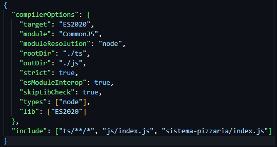
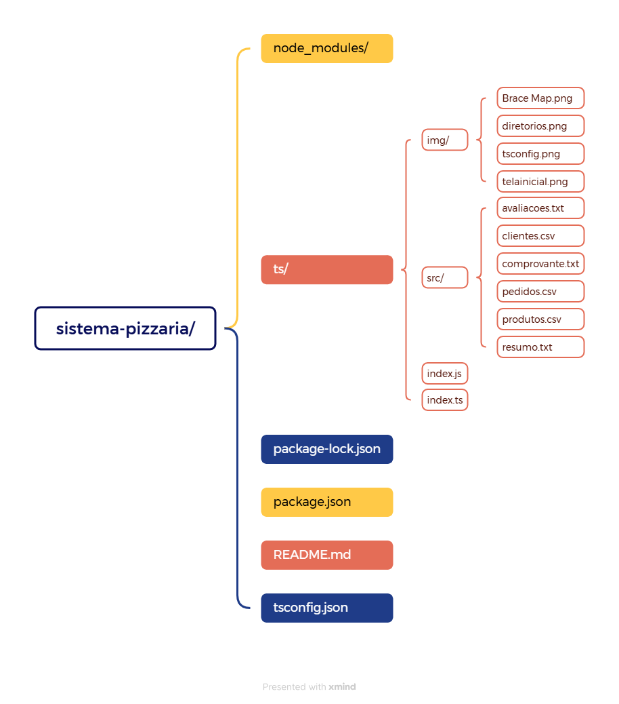
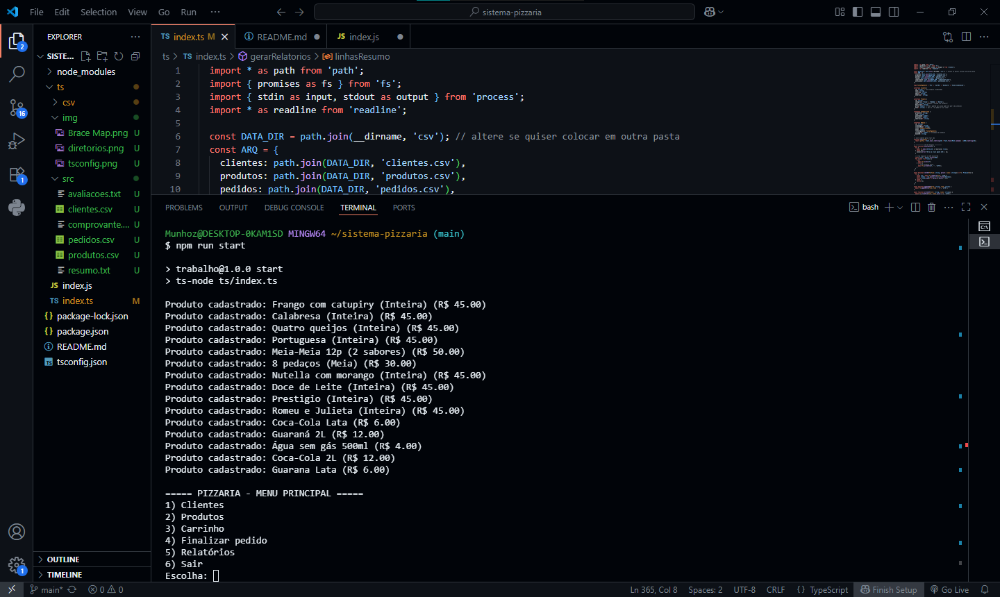

# Pizzaria Delivery - Sistema de Controle

Sistema de gerenciamento de pizzaria em **Node.js/TypeScript**. Permite cadastrar clientes e produtos, gerenciar carrinho, finalizar pedidos, emitir comprovantes e gerar relatórios completos.

### Autores
* Breno Miguel de Souza Afonso - RA: 2500998
* Nathalia Batista Munhoz - RA: 2501617
* Vanessa da Silva Santos - RA: 2520743
* Winley Jaeanty - RA: 2525564

---

## Tecnologias e Dependências

* **Node.js** >= 18
* **TypeScript** >= 5
* **readline** (nativo) – interface de input/output no console
* **fs/promises** (nativo) – manipulação de arquivos
* **path** (nativo) – gerenciamento de caminhos

> Todas as dependências do projeto são nativas do Node.js, portanto não há necessidade de instalar pacotes externos, a não ser que deseje adicionar recursos extras (ex: colors, dayjs, etc).

Exemplo de `package.json` mínimo:

```json
{
  "name": "trabalho",
  "version": "1.0.0",
  "main": "index.js",
  "scripts": {
    "test": "echo \"Error: no test specified\" && exit 1",
    "start": "ts-node ts/index.ts", "build": "tsc", "run:dist": "node dist/index.js"
  },
  "author": "",
  "license": "ISC",
  "description": "",
  "devDependencies": {
    "@types/node": "^24.3.1",
    "@types/readline-sync": "^1.4.8",
    "ts-node": "^10.9.2",
    "typescript": "^5.9.2"
  },
  "dependencies": {
    "readline-sync": "^1.4.10"
  }
}
```

Exemplo de `tsconfig.json`:



---

## Instalação

1. Clone o repositório:

```bash
git clone <URL_DO_REPOSITORIO>
cd sistema-pizzaria
```

2. Instale as dependências (apenas TypeScript para desenvolvimento):

```bash
npm install
```

3. Compile o TypeScript:

```bash
npm run build
```

4. Execute o sistema:

```bash
npm run start
```

---

## Estrutura do Projeto

```
sistema-pizzaria/
├─ node_modules
├─ ts/
│   ├─ img/ 
│       ├─ Brace Map.png
│       ├─ tsconfig.png
│       ├─ telainicial.png
│       └─ diretorios.png
│   ├─ src/              # Armazena os arquivos CSV e TXT                 
│       ├─ clientes.csv
│       ├─ produtos.csv
│       ├─ pedidos.csv
│       ├─ resumo.txt
│       ├─ comprovante.txt
│       └─ avaliacoes.txt
│   ├─ index.js
│   └─ index.ts          # Código principal do sistema
│
├─ package-lock.json
├─ package.json
├─ README.md
└─ tsconfig.json
```



---

## Funcionalidades

### Clientes

* Cadastrar, consultar, atualizar e excluir clientes
* Listar todos os clientes cadastrados

### Produtos

* Cadastrar produtos (Pizza, Bebida, Outros)
* Listar produtos e pesquisar por nome

### Carrinho e Pedidos

* Adicionar, ver, limpar e remover itens do carrinho
* Finalizar pedido com escolha de forma de pagamento
* Emissão de comprovante no console e arquivo

### Relatórios

* Gerar relatório completo de vendas
* Filtrar pedidos por período/data
* Mostrar top produtos e vendas por cliente

### Avaliações

* Clientes podem avaliar o atendimento de 1 a 5 estrelas
* Avaliações são registradas em `avaliacoes.txt`


---

## Tela Inicial



---

## Observações

* CSVs são criados automaticamente ao iniciar o sistema (`ensureFiles`)
* Campos com vírgula são substituídos por `;` para não quebrar o CSV
* IDs de clientes, produtos e pedidos são gerados automaticamente (`nid()`)

---